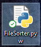

# **CS50 Final Project - File Sorter**
For my final project I decided to go for a simple, but useful program which sorts files that come into your downloads folder by using python programming language.
### **Video Demo**:  <URL "https://www.youtube.com/watch?v=1KwEudK9iDo&ab_channel=VytautasMatevi%C4%8Dius">
## **My Thought process while creating the program**
First of all I had to find a way to access all the files that were in my downloads folder. After some research on google I found out about a **scandir()** function and learned how to use it for my project. When that was done next I thought that I need to find a way for my program to react and do something whenever there was a change in my downloads folder. Again, after some research on google I came upon **watchdog** libarary. Then spent some time trying to implement it into my code. All that was left after that was to make a function that moves files depending on their type to a specific folder whenever a change happens in the downloads folder. To make that happen I searched for a way to move files and found out about **shutil.move()** method. It was not hard to implement it, but soon a problem occured, my program was not able to handle duplicate files. To deal with that I had to use a function that generates a random ID and then adds that ID to the files name. This way my program was able to handle duplicates without crashing. Then I thought I need to do something so this program runs all the time in the background so I won't have to keep the terminal minimized all the time and after some research I found out that you can rename the extension of your python script file to **.pyw**. This way it changes to executable file and when you open it, it starts running in the background and you can turn it off through task manager.
## **How to use it**
- By running the program through terminal window

- By running the program as an executable file

## **What types of files are being sorted**
- Executables
- Music
- Video
- Text
- Images
- Compressed files

## **Future plans**
- Fix any bugs that appear
- Add more types of files to sort
- Make the code more readable
- Look for ways to optimize this program if possible